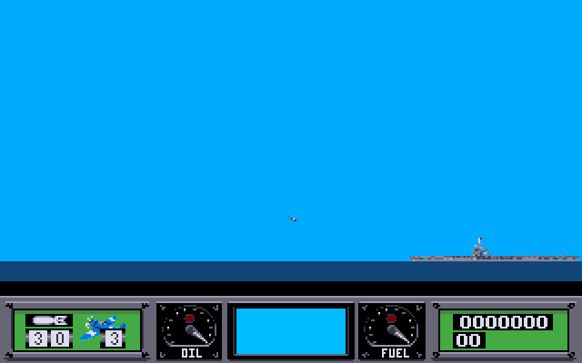
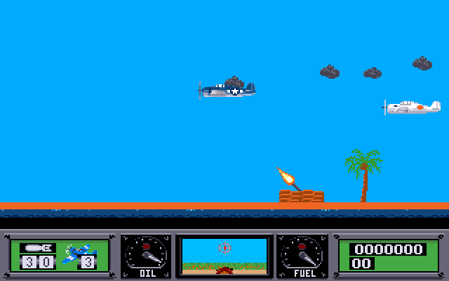

# Wings of Fury for the Atari STE

Brøderbund's Wings of Fury was never released for the Atari ST. This is a conversion of the Amiga version (1990)
for the Atari STE and Mega STE: all 15 maps, the ranks, the forward view, saved games, the original samples and
music.

 

It is a re-implementation, not a recompile. The Amiga program was taken apart to learn exactly how the game
behaves, and that behaviour was written again in C++ on top of [AGT](https://bitbucket.org/d_m_l/agtools), dml's
Atari Game Tools. The graphics, maps, samples and music are converted from the Amiga files by scripts.

| | |
|---|---|
| Machine | Atari STE or Mega STE, 2 MB of memory or more |
| Display | colour monitor or TV, 50 Hz |
| Controls | joystick in port 1, or cursor keys and space |
| Media | one 720 KB floppy, or a folder on a hard disk |

Ready-made disk image and hard disk version: [atari.love/wof](https://atari.love/wof/). The player's manual is
[manual/README.TXT](manual/README.TXT).

## What differs from the Amiga

- 16 colours on screen instead of 32; the pictures are reduced to fit.
- The sound plays through the STE's DMA sample hardware at 12.5 kHz, mixed in software.
- The briefing, name entry and hall of fame are in low resolution.
- Added: a pause page, a help page (H), a loading screen, Ctrl+Q to quit.
- Left out: the demo mode.

The remaining differences and open points are listed in [BACKLOG.md](BACKLOG.md).

## The repository

**`game/`** is the game itself. Nearly all of it is one file, `wof.cpp` (7400 lines): flight model, enemies,
weapons, missions, the front end, saved games and all drawing that AGT does not do. Beside it are the DMA sound
mixer (`snd.h`), the player for the original's menu music (`music.h`), the tables the tools generate
(`flight_data.h`, `snd_data.h` and others), the `Makefile`, and `assets_com.sh`, which cuts the graphics with AGT's
cutter. `game/source_assets/` holds what the cutter reads: per map a level picture and its map data, and the
sprite sheets (Hellcat, enemy planes, effects, crew, weapons, panel, fonts), all already in the port's 16 colours.

**`tools/`** is everything that runs on the development machine, in Python and shell:
- the decoders for the Amiga formats (`rpck.py`, `ppkc.py`, `iff.py`, `hunk.py`) and `convert_gfx.py`, which
  writes every picture and sprite frame out as PNG;
- the converters that turn those into the port's assets: `make_proto_assets.py` (levels, maps, sprite sheets, the
  colour reduction from 32 to 16), `make_panel.py`, `make_pics.py`, `make_sounds.py`, `make_music.py`,
  `make_intro.py`, the two font builders; `regen_assets.sh` runs them all;
- the release builders: `pack_disk.py` (ZX0 packing and the file bundles for the floppy), `make_st.py` (writes
  the 720 KB disk image), `make_release.sh`;
- the test rig: `run_hatari.sh`, `hatari_play.py` (plays one recorded flight in Hatari and collects screenshots),
  `suite.sh` (a set of them), `snapdiff.py` (compares the screenshots of two runs);
- `env.sh`, where all of them find AGT, the compiler, Python and Hatari.

**`tests/`** holds 51 recorded flights. Each is a text file of joystick input per game tick, with points where a
screenshot is taken and, in many, the result that must come out (the sequence of player states, the score). They
cover take-off and landing, each weapon, each kind of crash, the enemies, sinking ships, the front end and saved
games.

**`agt-patch/`** is one file, `agtools-local.patch`: the changes to AGT that the game needs, as a diff against
AGT's `master`. [docs/AGT_CHANGES.md](docs/AGT_CHANGES.md) explains each one.

**`amiga-original/`** holds the game's own files as they are on the Amiga disk: the program `wings`, the 15 maps, the
packed sprite banks and pictures in `shapes/`, the samples in `sounds/`, the songs and their player, the font.
Everything else is derived from these.

**`amiga-graphics/`** is the Amiga graphics decoded for inspection: each full-screen picture, a contact sheet per sprite
bank, every single frame under `frames/<bank>/` with its hot spot in `_frames.json`, the palettes, and a rendered
preview of each map in `maps/`. The converters read the frames from here.

**`reverse-engineering/`** is the reverse engineering of the Amiga program: the flat image `wings.bin`, the disassembly
(`wings_raw.s`), the Ghidra decompilation of all 743 functions (`wings_decomp.c`, and `wings_named.c` with names
applied), the call graph, the names found so far (`names/`) and the Ghidra scripts. `reverse-engineering/notes/` is the part to
read: one document per subsystem (player and flight, enemies, weapons and missions, rendering and sound, front
end, forward view, music) with the constants, tables, state machines and timings the port was written from, plus
`DESIGN.md`, the plan of the port, and `sound_ste.md`, the sound on the STE.

**`manual/`** holds `README.TXT`, the player's manual that goes on the disk (38 columns, so that it reads on an ST
in low resolution).

**`docs/`** holds the documents listed below, the screenshots of this page, and `sidecartridge/`: the report of a
file seek fault in the SidecarTridge cartridge's drive emulation, with a test program.

## Documents

- [docs/BUILDING.md](docs/BUILDING.md): what is needed, how to build, test and make a release
- [docs/AGT_CHANGES.md](docs/AGT_CHANGES.md): each change to AGT and why it was needed (the split screen on
  the standard display, the 200 Hz clock, level memory, file access)
- [docs/FORMATS.md](docs/FORMATS.md): the Amiga version's file formats
- [reverse-engineering/notes/](reverse-engineering/notes/): how the original works, subsystem by subsystem; `DESIGN.md` is the plan of the port,
  `sound_ste.md` the sound on the STE
- [docs/sidecartridge/](docs/sidecartridge/): a file seek fault of the SidecarTridge cartridge's drive emulation,
  with a test program
- [BACKLOG.md](BACKLOG.md): open points

## Building, in short

    git clone https://bitbucket.org/d_m_l/agtools.git ../agtools
    (cd ../agtools && git checkout a155d41 && git apply --whitespace=nowarn ../wings-of-fury-atari-ste/agt-patch/agtools-local.patch)
    python3 -m venv .venv && .venv/bin/pip install -r requirements.txt
    cd game && make                      # needs the m68k-atari-mint cross compiler
    cd .. && tools/make_release.sh        # floppy image and hard disk version in builds/

Details are in [docs/BUILDING.md](docs/BUILDING.md).

## How it works

- The game logic runs at the original's 12.5 ticks per second and draws every third vertical blank (16.7 frames
  per second), which is the Amiga version's own rate.
- The playfield is an AGT tile playfield, 16x16 tiles, scrolled by the STE's hardware; the larger maps are over 1500
  tiles (25000 pixels) wide. Below it, split off by a raster colour change, is the cockpit panel in its own palette.
- Sprites are drawn with the blitter. Large or rarely drawn sheets use AGT's plain sprite format, small frequent
  ones its compiled format, because the compiled sheets cost their file size in memory.
- Waves, sinking ships and damage to buildings are changes to the tile map: the game keeps its own tile blocks for
  them and marks the changed cells for redraw.
- The forward view in the panel's centre window is drawn by the game straight into the screen buffer.
- Sound: four voices mixed in software into a DMA buffer.
- One map is in memory at a time, in a zone that is emptied as a whole. On the floppy the data is packed with ZX0
  and unpacked on load.
- Testing: flights recorded as scripts are replayed in Hatari; where behaviour was in doubt, the same situation
  was set up in the Amiga version in vAmiga and compared.

## Credits and rights

Wings of Fury was written by Steve Waldo and published by Brøderbund Software. AGT is the work of dml.

The code of this conversion was written by Claude (Anthropic) in Claude Code, directed and tested on real
machines by the repository's owner.

The conversion's own code, tools, tests and documents are under the MIT licence; [NOTICE](NOTICE) says exactly
what [the licence](LICENSE) covers.

Wings of Fury is copyright 1987, 1990 Brøderbund Software, Inc. This is an unofficial fan conversion, free of
charge. The graphics, maps and sound are taken from the Amiga original and are included here so that the game can
be built, as are the disassembly and decompilation of the Amiga program; they remain the property of their owners
and the MIT licence does not apply to them. Nor does it apply to the AGT patch, which is a diff of dml's code.
